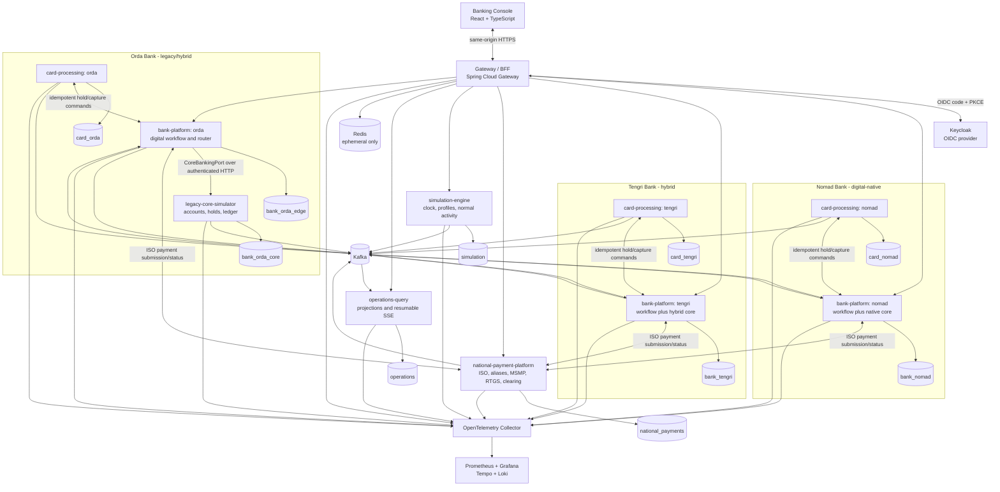

# C4 Container Architecture

> Classification: **SIMULATOR_DESIGN_CHOICE**. Container names describe this repository's fictional implementation and are not assertions about private systems used by real institutions.

## Application Containers

## Container Responsibilities

### Gateway / BFF

- Terminates browser authentication and enforces role/bank scope.
- Uses OIDC authorization-code plus PKCE and server-side token storage.
- Issues Secure, HttpOnly, SameSite cookies; mutations require CSRF protection.
- Routes commands to one bank based on authenticated claims, not arbitrary payload data.
- Proxies the operations SSE endpoint so browser clients do not need bearer-token query parameters.
- Contains no payment orchestration or financial state.

### Bank Platform

- Owns customer/channel metadata, devices, sessions, transfer intent, workflow history, payment routing, and bank audit events.
- Implements one `CoreBankingPort`; Orda uses a remote adapter while Nomad and Tengri use local adapters.
- Creates stable command, correlation, causation, end-to-end, and idempotency identifiers.
- Routes same-bank payments internally and different-bank payments only through the NPP simulator.
- Does not access card, NPP, or another bank's database.

### Financial Core

- Owns account products, account lifecycle, customer-deposit subledgers, holds, immutable journals, balance projections, and statements.
- Orda runs it in `legacy-core-simulator`; Nomad/Tengri run it as an in-process module.
- Exposes domain-specific commands, never a generic “post arbitrary journal” endpoint.
- Commits financial effect and outbox record atomically.

### Card Processor

- Owns synthetic card identifiers, lifecycle, limits, merchants, terminals, authorizations, captures, and reversals.
- Calls the bank's idempotent core boundary to create/release/capture a hold.
- Never stores real-looking PANs, CVVs, PINs, or magnetic-stripe data.
- Has one isolated deployment and database per fictional bank.

### National Payment Platform

- Owns participants, routing, aliases, ISO-message validation/history, RTGS queues, clearing cycles, and the authoritative participant settlement ledger.
- Is a modular monolith so validation, liquidity checks, and central settlement remain in one ACID transaction.
- Never connects to a bank database.

### Simulation Engine

- Owns deterministic seeds, virtual-time state, normal-customer activity schedules, and safe infrastructure-failure controls.
- Uses normal public APIs with a simulation service identity; it never inserts financial rows directly.
- Keeps wall-clock leases and retries independent of virtual time.

### Operations Query

- Consumes sanitized versioned events into durable read models.
- Provides topology, transaction stages, ledger views, settlement snapshots, event exploration, and a resumable SSE stream.
- Is eventually consistent and cannot authorize, reject, settle, reverse, or correct money.

## Infrastructure Containers

- PostgreSQL may be a single local server but hosts isolated logical databases and roles.
- Kafka transports at-least-once domain events; owner outboxes and consumer inboxes provide reliability.
- Redis supports BFF sessions, rate limits, and caches only.
- OpenTelemetry Collector routes traces; Prometheus/Grafana, Tempo, and Loki provide metrics, traces, and logs.
- Optional schema-registry and load-test profiles may be added without becoming startup requirements for the core financial path.
