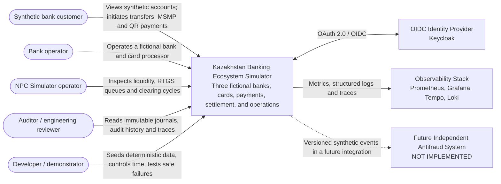
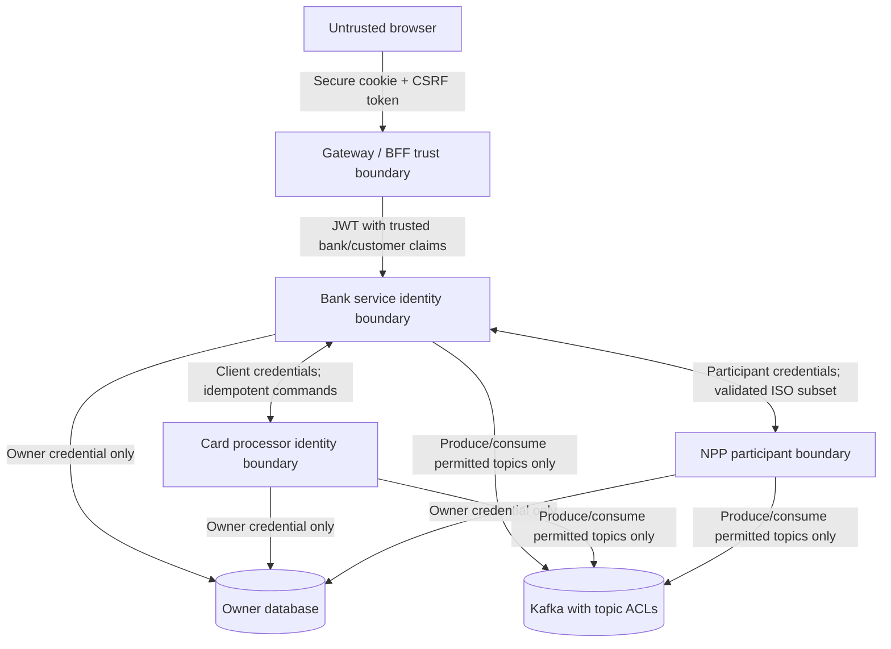

# C4 System Context

> Classification: **SIMULATOR_DESIGN_CHOICE**. Names and interactions in this diagram describe a fictional educational ecosystem, not a real Kazakhstan bank or payment operator.

## Context Diagram

## People and Responsibilities

| Person | Allowed use | Not allowed |
|---|---|---|
| Synthetic customer | Operate only accounts bound to the authenticated synthetic customer and bank | Select another bank/customer in a request body; use operational APIs |
| Bank operator | Inspect and operate resources belonging to one fictional bank | Modify another bank or NPP settlement records directly |
| NPC Simulator operator | Inspect participants, liquidity, queues, cycles, and safe failure controls | Edit bank customer balances or journals |
| Auditor | Read cross-system audit, ledger, message, and trace views | Execute financial commands |
| Developer/demonstrator | Seed/reset explicitly marked development data and run simulations | Invoke development reset controls in a production profile |

## System Boundary

Inside the simulator boundary are the three banks, their card processors, the national payment platform simulator, the simulation engine, the user interface, operational projections, Kafka, PostgreSQL, Redis, and local observability.

Keycloak is shown as a supporting external system because it has its own security lifecycle and database. It remains part of the local Compose deployment.

The future antifraud system is deliberately outside the implementation boundary. It may later subscribe to sanitized synthetic events, but the current platform contains no risk score, fraud flag, classifier, blocking rule, or analyst fraud workflow.

## Trust Boundaries

Browser-supplied `bankId`, actor, role, account owner, and participant identity are never trusted when those values can be derived from an authenticated principal or service credential.
