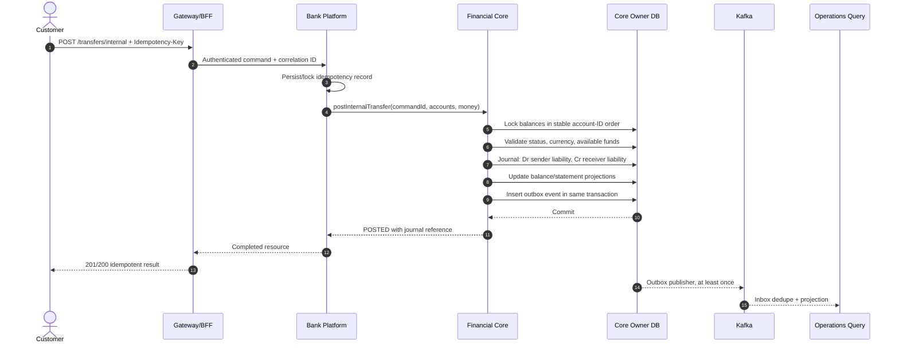
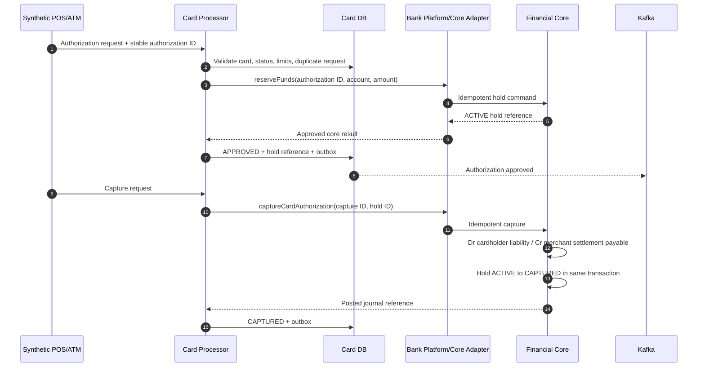
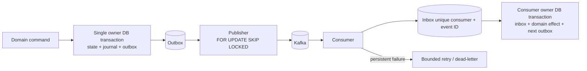
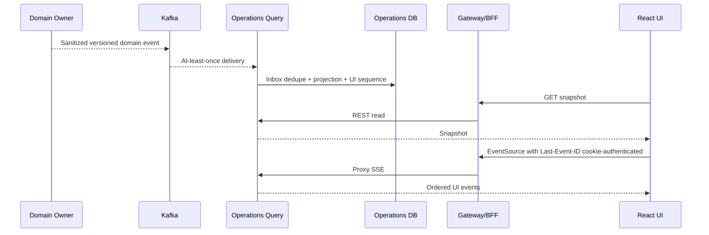

# Financial and Event Data Flows

> Classification: **SIMULATOR_DESIGN_CHOICE**. These flows are implementation contracts for the fictional simulator. They are not descriptions of a real national or commercial-bank implementation.

## Correlation and Time

The gateway creates or validates a request ID and correlation ID. The initiating command ID, correlation ID, and W3C `traceparent` propagate through synchronous calls, owner outboxes, Kafka headers, NPP messages, recipient processing, and operations projections.

Two timestamps are retained:

- `occurredAt`: wall-clock UTC for audit, ordering, security, leases, and recovery;
- `simulationTime`: virtual business time for value dates, scheduled activity, and clearing cut-offs.

Virtual-clock pause or acceleration never changes token expiry, idempotency retention, database lock leases, retry backoff, or audit time.

## Internal Transfer



Nomad and Tengri invoke the core port in process. Orda invokes the remote legacy core. The remote boundary may make the edge workflow eventually consistent, but the entire debit/credit/journal/outbox effect remains atomic in the Orda core database.

## Instant Interbank Transfer: RTGS or MSMP

```mermaid
sequenceDiagram
    autonumber
    actor Customer
    participant A as Origin Bank
    participant ACore as Origin Core
    participant NPP as National Payment Platform
    participant NDB as NPP Settlement DB
    participant Kafka
    participant B as Receiver Bank
    participant BCore as Receiver Core

    Customer->>A: Create interbank/MSMP payment
    opt MSMP or QR
        A->>NPP: Resolve alias/QR destination
        NPP-->>A: Version-bound resolution token
    end
    A->>ACore: Reserve funds, stable command ID
    ACore-->>A: Hold reference
    A->>ACore: Fund outgoing instruction
    ACore->>ACore: Dr customer liability / Cr rail payable; capture hold
    ACore-->>A: FUNDED
    A->>NPP: pacs.008 subset, sender-scoped MsgId
    NPP->>NPP: Validate participant, message and idempotency
    alt sufficient liquidity
        NPP->>NDB: Lock participant positions
        NPP->>NDB: Dr sender participant liability / Cr receiver participant liability
        NPP->>NDB: SETTLED + outbox, one ACID transaction
        NDB-->>Kafka: Settlement/status event, at least once
        Kafka-->>A: Sender settlement advice
        A->>ACore: Dr rail payable / Cr NPP settlement asset
        Kafka-->>B: Final inbound settlement advice
        B->>BCore: Dr NPP settlement asset / Cr inbound suspense
        B->>BCore: Dr inbound suspense / Cr beneficiary deposit
        B-->>Kafka: Beneficiary credited acknowledgment
        Kafka-->>A: BENEFICIARY_CONFIRMED
    else insufficient liquidity
        NPP->>NDB: Persist QUEUED_LIQUIDITY, no settlement journal
        NDB-->>Kafka: Queued status
    end
```

After the NPP settlement journal commits, it is final. If the receiver is unavailable, the settlement event is retried and reconciled. The payment is not compensated. If the beneficiary cannot be credited, funds stay in bank-owned inbound suspense and a new return payment is created.

Before central settlement, an NPP rejection allows the origin core to reverse the funding journal:

```text
Dr Outbound Rail Payable
Cr Sender Customer Deposit Liability
```

Compensation requires a definitive NPP non-settlement state. A timeout alone is an unknown result and must be queried or retried with the same identifiers.

## Clearing Cycle

```mermaid
sequenceDiagram
    autonumber
    participant Banks as Participating Banks
    participant NPP as Clearing Module
    participant Ledger as NPP Settlement Ledger
    participant Kafka
    participant Core as Each Bank Core

    Banks->>NPP: Submit funded clearing-eligible payments
    NPP->>NPP: Accept into OPEN cycle
    NPP->>NPP: Freeze cycle at cut-off
    NPP->>NPP: Compute gross obligations and participant net positions
    NPP->>NPP: Assert sum(net positions) = 0
    alt all net debtors have liquidity
        NPP->>Ledger: One multilateral journal: Dr debtors / Cr creditors
        NPP->>NPP: Mark cycle SETTLED + outbox atomically
        NPP-->>Kafka: Cycle result and per-bank obligations
        Kafka-->>Core: Apply bank cycle settlement idempotently
        Core->>Core: Clear outgoing payable; move net settlement asset; create inbound suspense
        Core->>Core: Credit each valid beneficiary from suspense
    else a net debtor lacks liquidity
        NPP->>NPP: Mark SETTLEMENT_BLOCKED; post no central journal
        NPP-->>Kafka: Blocked-cycle status
    end
```

The central cycle is all-or-none. A blocked cycle may be retried after simulated liquidity is added. Partial central settlement is excluded from the first version.

## Card Authorization, Capture, and Reversal



If the core response is lost, the authorization remains `PENDING_CORE`; the card processor retries or queries using the same command ID. It never converts an ambiguous timeout directly into a decline.

An authorization reversal before capture releases the hold and posts no journal. A capture reversal before merchant settlement posts an inverse journal. After merchant settlement, money returns only through a new refund transaction.

## Transactional Outbox and Inbox



The publisher may crash after Kafka acknowledges but before `published_at` is recorded. Duplicate publication is therefore normal. Consumers combine event-ID inbox deduplication with business uniqueness such as payment ID, settlement ID, authorization ID, journal source reference, and cycle ID.

Dead-lettering never silently cancels or reverses money. Operators inspect and replay after fixing the cause; reconcilers query owner systems when state is uncertain.

## Operations and UI Flow



The operations feed is a projection, not an event-sourced financial authority. It may lag. A retention gap produces a `reset-required` control event, after which the UI fetches a fresh snapshot.

## Failure and Reconciliation Matrix

| Failure | Safe behavior |
|---|---|
| Duplicate customer POST | Return prior result for the same request hash; reject key reuse with different content |
| Core timeout | Query/retry identical core command; do not assume rejection |
| NPP timeout after submission | Query by participant and message ID or resubmit identical message |
| Kafka publish succeeds but outbox mark fails | Duplicate publish; inbox/business key prevents a duplicate effect |
| Receiver bank offline after NPP settlement | Central result remains final; recipient event retries and reconciliation exposes lag |
| Card processor crashes after hold | Authorization remains recoverable; hold expires by core policy if never completed |
| Clearing debtor lacks liquidity | Whole cycle remains blocked; no participant position changes |
| Operations consumer unavailable | Financial processing continues; dashboards catch up later |
| Notification unavailable | Financial processing continues; notification retry is eventual |
