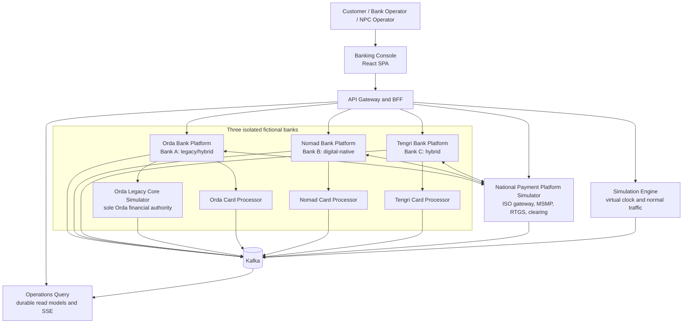

# Architecture Overview

> Classification: **SIMULATOR_DESIGN_CHOICE**. This document describes an educational banking ecosystem simulator. It does not claim to reproduce the private architecture of any real bank, the National Bank of Kazakhstan, or the National Payment Corporation of Kazakhstan.

## Purpose

The system models three fictional banks, a simulated national payment layer, card-processing boundaries, and realistic operational tooling. Its primary architectural goals are:

- financially correct, immutable double-entry accounting;
- isolated operational state for every bank;
- explicit finality and compensation rules for distributed payments;
- reliable at-least-once event delivery without duplicate monetary effects;
- a runnable local environment that does not fragment every domain into a separate microservice;
- rich, synthetic events suitable for a future independent antifraud consumer.

Antifraud scoring, fraud labels, rules, anomaly detection, and transaction blocking are explicitly outside this system.

## Architectural Style

The simulator uses a **modular-monolith-per-financial-authority** design. Components that must commit money atomically live in one application and one database transaction. Physical service boundaries are retained where ownership or failure domains genuinely differ: digital-bank workflow, Bank A's legacy-style core, card processing, national settlement, simulation control, and operational projections.



The common `bank-platform` artifact is deployed three times. Each instance has a distinct identity, service credential, topic permissions, configuration, and operational database. It is not a multi-tenant process.

## Bank Profiles

| Fictional bank | Profile | Core adapter | Financial system of record | Deliberate differences |
|---|---|---|---|---|
| Orda Bank | Legacy/hybrid | Remote `CoreBankingPort` | `legacy-core-simulator` and `bank_orda_core` | Explicit digital/core boundary, configurable legacy latency, synchronous core adapter, Kafka integration |
| Nomad Bank | Digital-native | In-process native adapter | Native core schemas in `bank_nomad` | Low-latency API-first flow, fast outbox cadence, aggressive non-financial caching |
| Tengri Bank | Hybrid | In-process hybrid adapter | Native core schemas in `bank_tengri` | Modern channels and events with configurable batch-oriented projections and clearing preference |

The core domain and accounting invariant code are shared. Profiles alter adapters, routing preferences, simulated latency, and operational characteristics; they do not fork monetary rules.

Orda's edge database must not contain account-balance, hold, journal, or ledger-entry tables. The remote legacy core is the only Orda balance authority. Account reads traverse the core port; a short-lived edge cache may improve display latency but is never used to authorize a debit.

## Deployable Types and Instance Count

| Artifact | Instances | Responsibility |
|---|---:|---|
| `gateway` | 1 | Same-origin browser boundary, OIDC BFF, routing, CSRF, rate limits |
| `bank-platform` | 3 | Customer/channel model, transfer orchestration, payment routing, core adapter |
| `legacy-core-simulator` | 1 | Orda accounts, holds, immutable ledger, statements, financial commands |
| `card-processing-simulator` | 3 | Per-bank card lifecycle, limits, authorization/capture workflow |
| `national-payment-platform` | 1 | Participants, aliases, ISO subset, RTGS, clearing, settlement ledger |
| `simulation-engine` | 1 | Deterministic normal activity, virtual clock, safe failure controls |
| `operations-query` | 1 | Cross-system read models, transaction stages, topology snapshots, SSE |
| `banking-console` | 1 | Role-routed customer and operations web interface |

There are seven backend artifact types and eleven JVM instances. This is intentionally smaller than a service-per-domain design. Local JVM limits and Compose profiles keep the ecosystem runnable; no profile may merge bank financial state.

## Systems of Record

| Information | Authoritative owner | Important qualification |
|---|---|---|
| Credentials, login, roles | Keycloak | Bank customer IDs and bank IDs are trusted token claims, not request-body choices |
| Synthetic customer profile, devices, sessions | Corresponding bank platform | Orda core stores only the financial party/account reference it needs |
| Account, product, status | Corresponding financial core | Orda core DB for Orda; bank DB for Nomad/Tengri |
| Book balance, holds, journal, statement | Corresponding financial core | Ledger is authoritative; balance and statement tables are rebuildable projections |
| Customer-facing transfer workflow | Originating bank platform | Core command state remains authoritative for the financial posting stage |
| Card lifecycle and authorization status | Corresponding card processor | The linked account hold remains core-owned |
| Participant and routing directory | National payment platform | No bank edits another bank's routing data directly |
| Phone/QR alias registry | National payment platform | Aliases and identifiers are synthetic and non-routable outside the simulator |
| RTGS/clearing state and settlement positions | National payment settlement ledger | Bank settlement assets are mirrors reconciled to this authority |
| Simulation run and virtual time | Simulation engine | Wall-clock UTC still governs security, audit, leases, and retries |
| Dashboard, topology, and trace views | Operations query DB | Derived and eventually consistent; never used for a financial decision |
| Event delivery | Producer outbox and consumer inbox | Kafka is durable transport, not the source of financial truth |
| Cache and session acceleration | Redis | Redis is never the only idempotency or ledger store |

There is no single cross-system `transaction_status` column. A bank transfer, a card authorization, and an NPP rail instruction have separate authoritative state machines. The operations read model correlates them without becoming an authority.

## Consistency Boundaries

Strong ACID consistency is required for:

- ledger journal plus entries;
- account/hold projection changes caused by that journal;
- financial-command state plus owner outbox insertion;
- internal transfer debit and credit;
- NPP participant settlement journal and position projections;
- clearing-cycle freeze, net calculation, and central settlement decision;
- inbox deduplication plus the consumer's local financial effect.

Eventual consistency is acceptable for:

- bank saga status after a remote core command;
- bank mirrors after NPP has achieved final settlement;
- notifications, analytics, topology, transaction traces, and dashboards;
- caches and search projections.

An unavailable receiver after final settlement creates a delayed beneficiary credit or suspense balance, never an automatic rollback of the NPP settlement ledger.

## Storage and Local Isolation

One local PostgreSQL server may host separate logical databases, provided that every database has a distinct owner role and no application credential can connect across boundaries:

```text
bank_orda_edge    bank_orda_core
bank_nomad        bank_tengri
card_orda         card_nomad         card_tengri
national_payments simulation         operations
keycloak
```

Production-like Helm values permit separate PostgreSQL clusters without changing application contracts. Cross-owner foreign keys and direct SQL reads are forbidden.

## Shared Contracts, Not Shared State

The monorepo may share immutable value types, event/OpenAPI schemas, core accounting domain code, outbox infrastructure, observability, and test fixtures. It must not share JPA entities, database repositories, mutable caches, or credentials between bounded contexts.

See:

- [C4 system context](c4-context.md)
- [C4 containers](c4-container.md)
- [Service map](service-map.md)
- [Data flows](data-flow.md)
- [Accounting and ledger](../banking/accounting-and-ledger.md)
- [Transfers](../banking/transfers.md)
