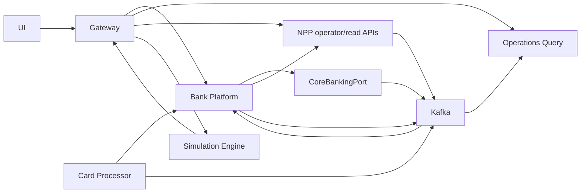

# Service Map and Contracts

> Classification: **SIMULATOR_DESIGN_CHOICE**. This service map is an implementation contract for fictional systems only.

## Deployments and Ownership

| Deployment | Instances | Database | Synchronous dependencies | Events produced |
|---|---:|---|---|---|
| `gateway` | 1 | Redis session store only | Keycloak, bank platforms, NPP operator API, simulation, operations query | Security/HTTP telemetry only |
| `bank-platform` | 3 | `bank_orda_edge`, `bank_nomad`, `bank_tengri` | Core adapter, corresponding card processor, NPP ISO gateway | customer, session, transfer, payment workflow |
| `legacy-core-simulator` | 1 | `bank_orda_core` | None for a posting decision | account, hold, journal, statement |
| `card-processing-simulator` | 3 | one `card_*` DB each | Corresponding bank core endpoint | card, authorization, capture, reversal |
| `national-payment-platform` | 1 | `national_payments` | None for central settlement decision | interbank, ISO, RTGS, clearing, position |
| `simulation-engine` | 1 | `simulation` | Gateway/application APIs | run, clock, scenario lifecycle |
| `operations-query` | 1 | `operations` | Health/read APIs only | SSE/read-model lifecycle, no domain commands |

## Allowed Dependency Direction



Forbidden dependencies:

- one bank querying or changing another bank's database;
- a bank changing participant settlement balances directly;
- NPP querying customer account tables;
- card processing changing account balances directly;
- operations/query or frontend code issuing ledger postings;
- simulation code seeding finance tables with SQL;
- Redis or Kafka reads deciding an authoritative account balance.

## Public API Surface

The gateway exposes versioned JSON/OpenAPI endpoints. The authenticated bank and customer are derived from the principal.

```text
GET  /api/v1/me/accounts
GET  /api/v1/me/accounts/{accountId}/transactions
GET  /api/v1/me/cards
POST /api/v1/transfers/internal
POST /api/v1/transfers/interbank
POST /api/v1/payments/msmp
POST /api/v1/payments/qr/resolve
POST /api/v1/payments/qr
GET  /api/v1/transactions/{transactionId}
GET  /api/v1/transactions/{transactionId}/trace
```

All financial POST requests require an `Idempotency-Key`. A repeat with the same principal, operation, key, and request hash returns the recorded outcome. Reuse with a different request hash returns `409 Conflict`.

The common error envelope contains:

```json
{
  "code": "INSUFFICIENT_AVAILABLE_FUNDS",
  "message": "The account does not have enough available funds.",
  "timestamp": "2026-09-04T12:00:00Z",
  "trace_id": "...",
  "details": {}
}
```

Stack traces and secrets are never included.

## CoreBankingPort

The port is a Java interface for Nomad/Tengri and an authenticated HTTP contract for Orda. It exposes business commands rather than general ledger access:

```text
getAccount(accountId, actorContext)
reserveFunds(commandId, accountId, money, expiresAt)
releaseHold(commandId, holdId, reason)
postInternalTransfer(commandId, source, destination, money, fee)
fundInterbankPayment(commandId, holdId, rail, money, fee)
settleOutboundPayment(commandId, paymentId, settlementReference)
refundUnsettledPayment(commandId, paymentId, reason)
recognizeInboundSettlement(commandId, paymentId, money)
creditInboundBeneficiary(commandId, paymentId, accountId, money)
captureCardAuthorization(commandId, holdId, merchantReference)
reverseCardCapture(commandId, captureId, reason)
```

Every command is idempotent and queryable by `commandId`. A timeout yields an unknown outcome; callers retry or query with the same command ID and never assume failure.

## Bank-to-NPP Contract

```text
POST /iso/v1/messages
GET  /api/v1/payments/{paymentId}
GET  /api/v1/participants/{participantId}/settlement-position
POST /api/v1/aliases/resolve
POST /api/v1/aliases
POST /operator/v1/clearing/cycles/{cycleId}/close
POST /operator/v1/rtgs/queue/run
```

The participant is derived from service credentials. The ISO adapter records a sender-scoped message ID and payload hash. Duplicate IDs with the same content return the stored result; different content is rejected.

## Operations API

```text
GET /api/v1/operations/overview
GET /api/v1/operations/topology
GET /api/v1/operations/transactions/{id}/trace
GET /api/v1/operations/ledger/{transactionId}
GET /api/v1/operations/settlement
GET /api/v1/operations/clearing
GET /api/v1/operations/events
GET /api/v1/operations/stream
```

The SSE feed uses a durable monotonically increasing operations sequence and supports `Last-Event-ID`. If a requested sequence is outside retention, it emits `reset-required`; the client reloads an authoritative snapshot from the operations read model.

## Event Topics

| Topic | Key | Principal producers | Principal consumers |
|---|---|---|---|
| `bank.orda.domain.v1` | aggregate ID | Orda edge/core | Orda workflow, operations |
| `bank.nomad.domain.v1` | aggregate ID | Nomad | operations |
| `bank.tengri.domain.v1` | aggregate ID | Tengri | operations |
| `card.{bank}.domain.v1` | authorization/card ID | Card processor | bank notification/projector, operations |
| `npp.payments.v1` | payment ID | NPP | sender/receiver bank, operations |
| `npp.settlement.v1` | payment or cycle ID | NPP | banks, operations |
| `npp.clearing.v1` | cycle ID | NPP | banks, operations |
| `simulation.lifecycle.v1` | run ID | Simulation engine | operations |

Each owner also defines bounded retry and dead-letter topics. Topic ACLs permit only required produce/consume operations.

The event envelope contains `eventId`, type/version, wall-clock time, simulation time, producer, bank/participant context, aggregate ID/version, correlation/causation IDs, `traceparent`, data classification, and payload. Aggregate keys preserve per-aggregate order; consumers still validate legal state transitions and tolerate duplicates.

## Bank-specific Configuration

Safe configuration differences include:

- core adapter: remote legacy, native, or hybrid;
- preferred eligible rail and RTGS amount threshold;
- clearing window and payment limits;
- simulated adapter latency/failure controls;
- outbox polling batch/interval;
- read-cache TTL and projection cadence;
- display metadata and topology labels.

Accounting rules, idempotency, money scale, settlement finality, authorization, and security controls are not configurable per bank.
