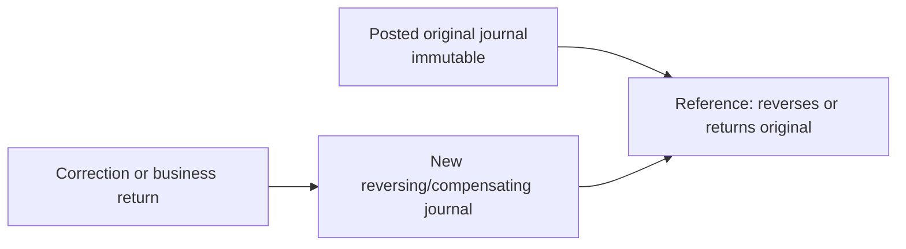

# Accounting and Immutable Ledger

> Classification: **SIMULATOR_DESIGN_CHOICE**. This is a simplified but internally consistent accounting model for a fictional educational simulator. It is not an official chart of accounts or accounting policy of any real institution.

## Non-negotiable Invariants

1. Every posted journal balances: total debits equal total credits for each currency.
2. Posted entries are immutable and cannot be deleted.
3. Corrections use a new reversal, compensation, refund, or return journal.
4. Money uses decimal arithmetic and an explicit currency; Java `double`/`float` are forbidden.
5. A financial command and source reference produce at most one monetary effect.
6. Account and settlement projections update in the same transaction as their journal.
7. KZT is the initial end-to-end payment currency. A journal may not hide an FX conversion.

## Debit and Credit Convention

Entries store a positive amount plus a `DEBIT` or `CREDIT` side. Nullable debit/credit columns and signed input amounts are avoided.

| Account class | Debit effect | Credit effect | Normal balance |
|---|---|---|---|
| Asset | Increase | Decrease | Debit |
| Liability | Decrease | Increase | Credit |
| Expense | Increase | Decrease | Debit |
| Income | Decrease | Increase | Credit |
| Equity | Decrease | Increase | Credit |

A customer's deposit is a liability of the bank. Therefore debiting the customer-deposit ledger account lowers the customer-visible balance; crediting it raises the balance.

## Money Value

Conceptually:

```java
record Money(BigDecimal amount, CurrencyCode currency) {}
```

Rules:

- command amounts must be positive;
- KZT/USD/EUR accept the configured ISO 4217 minor-unit scale, initially two decimals;
- extra precision is rejected, never silently rounded;
- persistence uses `NUMERIC(19,2)` for the initial currency set;
- arithmetic requires matching currencies;
- zero is permitted for calculated positions but not a transfer or ledger entry;
- a posting engine creates all entry amounts; controllers never construct arbitrary journals.

## Data Model

```text
ledger_account
  id, owner_type, owner_id, account_class, normal_side,
  currency, control_code, status, created_at

journal_transaction
  id, journal_type, source_transaction_id, command_id,
  reference, correlation_id, posting_date, value_date,
  created_at, status

ledger_entry
  id, journal_id, ledger_account_id, side,
  amount, currency, sequence, description
```

Each customer account maps to a liability subledger account under a customer-deposits control. Control balances are derived by aggregation; they are not independently editable totals.

An application transaction inserts a draft journal and all entries, then changes the journal to `POSTED`. A database trigger or posting procedure verifies per-currency sums at that transition. Database permissions/triggers reject updates and deletes of posted journal financial fields and ledger entries.

Reversal metadata is placed on the new reversal journal (`reverses_journal_id`). The original remains unchanged.

## Simplified Bank Chart

| Code | Class | Name | Purpose |
|---|---|---|---|
| 1100 | Asset | NPP settlement asset | Bank's claim on its NPP simulator participant position |
| 1110 | Asset | ATM cash asset | Synthetic cash held in bank-owned ATMs |
| 1190 | Asset | Simulation funding asset | Explicit seed counterpart only |
| 2100 | Liability | Customer deposits | Parent for account-level customer liability subledgers |
| 2200 | Liability | Outbound RTGS payable | Customer funds captured for unsettled RTGS instructions |
| 2210 | Liability | Outbound MSMP payable | Customer funds captured for unsettled MSMP instructions |
| 2220 | Liability | Outbound clearing payable | Gross funded clearing instructions awaiting a cycle |
| 2230 | Liability | Inbound payment suspense | Final instant settlement received but not credited |
| 2240 | Liability | Inbound clearing suspense | Settled clearing receipts awaiting beneficiary credit |
| 2250 | Liability | Card merchant settlement payable | Captured purchases awaiting merchant settlement |
| 4100 | Income | Fee income | Explicit transaction and ATM fees |
| 3100 | Equity | Simulation opening equity | Explicit initial-balance counterpart where needed |

The NPP has a separate chart:

| Class | Name | Purpose |
|---|---|---|
| Asset | Simulator settlement-reserve control | Explicit backing counterpart for seeded participant positions |
| Liability | Participant settlement liability: Orda | NPP amount owed to Orda |
| Liability | Participant settlement liability: Nomad | NPP amount owed to Nomad |
| Liability | Participant settlement liability: Tengri | NPP amount owed to Tengri |

Bank and NPP ledgers are separately balanced legal-entity-style books. Reconciliation compares each bank's NPP settlement asset to the corresponding NPP participant liability after all committed advice has been applied.

## Opening and Seed Postings

Opening an account at zero posts no journal. Deterministic demo funding uses an explicitly labeled seed transaction:

| Entity | Debit | Credit |
|---|---|---|
| Bank | Simulation funding/NPP settlement asset | Customer deposit liability |
| NPP | Simulator settlement-reserve control asset | Participant settlement liability |

Seed totals must be configured so each bank's settlement asset and its NPP participant liability initially agree. No seed row may look like a real deposit source.

## Internal Transfer

For amount `M` and optional fee `F`:

| Debit | Credit |
|---|---|
| Sender customer-deposit liability `M + F` | Recipient customer-deposit liability `M` |
|  | Fee income `F` |

With no fee, the journal has one debit and one credit. Sender and recipient balance projections, both statement rows, transfer state, and outbox records commit atomically.

## Holds

Authorization holds are off-ledger reservations:

```text
available balance = book balance - active holds
```

Create, release, or expire a hold without a GL journal. Capture performs the financial journal and changes the hold from `ACTIVE` to `CAPTURED` in the same transaction.

## Interbank RTGS or MSMP

### 1. Capture customer funds

For amount `M` and fee `F`:

| Debit | Credit |
|---|---|
| Sender customer-deposit liability `M + F` | Rail-specific outbound payable `M` |
|  | Fee income `F` |

The associated hold is captured. The bank now owes `M` to the rail instead of the customer.

### 2. Central settlement

For Orda sending `M` to Nomad, the NPP posts:

| Debit | Credit |
|---|---|
| Orda participant settlement liability `M` | Nomad participant settlement liability `M` |

This atomically decreases Orda's position and increases Nomad's. Insufficient available participant liquidity produces no journal and moves the instruction to the liquidity queue.

### 3. Origin bank applies final settlement advice

| Debit | Credit |
|---|---|
| Outbound rail payable `M` | NPP settlement asset `M` |

The payable is extinguished and the origin bank's NPP asset decreases.

### 4. Receiver recognizes settlement

| Debit | Credit |
|---|---|
| NPP settlement asset `M` | Inbound payment suspense `M` |

This step mirrors the central final position even if beneficiary processing is temporarily unavailable.

### 5. Receiver credits beneficiary

| Debit | Credit |
|---|---|
| Inbound payment suspense `M` | Beneficiary customer-deposit liability `M` |

For a valid preconfirmed beneficiary, steps 4 and 5 may be two journals in one database transaction. Keeping the suspense boundary explicit permits recovery and returns if account credit fails.

### Rejection before final settlement

If customer funding occurred but NPP definitively rejects/expires/cancels before central settlement:

| Debit | Credit |
|---|---|
| Outbound rail payable `M` | Sender customer-deposit liability `M` |
| Fee income `F`, when refundable | Sender customer-deposit liability `F` |

This is a new compensating journal. A timeout alone is not proof of non-settlement.

### Return after final settlement

The original payment remains settled. A new reverse-direction return instruction references it. If the receipt is still in suspense, return funding begins:

| Debit | Credit |
|---|---|
| Inbound payment suspense `M` | Outbound return payable `M` |

If the beneficiary was already credited, the return begins by debiting that beneficiary account subject to the return policy. NPP settles the new instruction like any other payment.

## Clearing

### Payment submission at a sender bank

Each outgoing clearing item `M` posts:

| Debit | Credit |
|---|---|
| Sender customer-deposit liability `M` | Outbound clearing payable `M` |

NPP acceptance into an open cycle does not move participant settlement money.

### Central multilateral net settlement

For participant `i`:

```text
gross_out_i = sum accepted payments sent by i
gross_in_i  = sum accepted payments received by i
net_i       = gross_in_i - gross_out_i
sum(net_i)  = 0
```

In one NPP journal:

- debit participant liabilities for every `net_i < 0` by `abs(net_i)`;
- credit participant liabilities for every `net_i > 0` by `net_i`.

Total debtor debits must equal total creditor credits. The cycle does not settle partially in version 1.

### Each bank applies the settled cycle

Let `O = gross_out`, `I = gross_in`, and `N = I - O`:

| Debit | Credit |
|---|---|
| Outbound clearing payable `O` | Inbound clearing suspense `I` |
| NPP settlement asset `max(N, 0)` | NPP settlement asset `max(-N, 0)` |

Zero-valued lines are omitted. Balance proof:

```text
O + max(I - O, 0) = I + max(O - I, 0)
```

Each valid inbound item is then credited:

| Debit | Credit |
|---|---|
| Inbound clearing suspense `M` | Beneficiary customer-deposit liability `M` |

### Worked example

```text
Orda -> Nomad  400,000 KZT
Nomad -> Orda   50,000 KZT
```

Orda has `O=400,000`, `I=50,000`, `N=-350,000`:

```text
Dr Outbound Clearing Payable       400,000
Cr NPP Settlement Asset            350,000
Cr Inbound Clearing Suspense        50,000
```

Nomad has `O=50,000`, `I=400,000`, `N=350,000`:

```text
Dr Outbound Clearing Payable        50,000
Dr NPP Settlement Asset            350,000
Cr Inbound Clearing Suspense       400,000
```

NPP debits Orda's participant liability 350,000 and credits Nomad's 350,000.

## Card Purchase

Authorization posts no journal; it creates a hold.

Capture:

| Debit | Credit |
|---|---|
| Cardholder customer-deposit liability `M` | Card merchant settlement payable `M` |

On-us merchant settlement:

| Debit | Credit |
|---|---|
| Card merchant settlement payable `M` | Merchant customer-deposit liability `M` |

Capture reversal before merchant settlement:

| Debit | Credit |
|---|---|
| Card merchant settlement payable `M` | Cardholder customer-deposit liability `M` |

After merchant settlement, a refund is a new transaction rather than a mutation of the capture.

## ATM Withdrawal

For cash `M` and fee `F`:

| Debit | Credit |
|---|---|
| Customer-deposit liability `M + F` | ATM cash asset `M` |
|  | Fee income `F` |

If dispense confirmation fails, release the authorization hold and post no withdrawal. The physical-cash model is synthetic; ATM cash is seeded with a separate asset-transfer journal where needed.

## Immutability and Reversal



An original journal may expose a derived `hasReversal` flag, but its entries, amounts, dates, and status are never edited. A reversal must itself balance and be idempotent.

## Invariant and Property Tests

At minimum, automated tests must prove:

- every journal balances per currency;
- a posted entry cannot be updated or deleted using the application role;
- the same command/event cannot post twice;
- internal transfer preserves total customer-deposit liability when fees are zero;
- a capture converts a hold into a book debit without changing available balance twice;
- a rejected unsettled interbank payment restores the expected customer position;
- final settlement plus recipient credit reconciles both bank settlement assets to NPP positions;
- clearing net positions sum to zero and the bank posting equation balances for arbitrary gross values;
- a reversal restores the expected position while leaving the original journal unchanged;
- concurrent debits cannot create an unauthorized negative available balance;
- rebuilding account balances and statements from ledger entries yields the stored projections.
