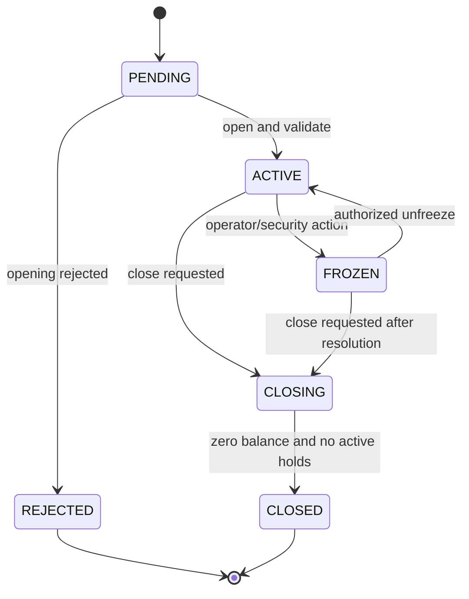
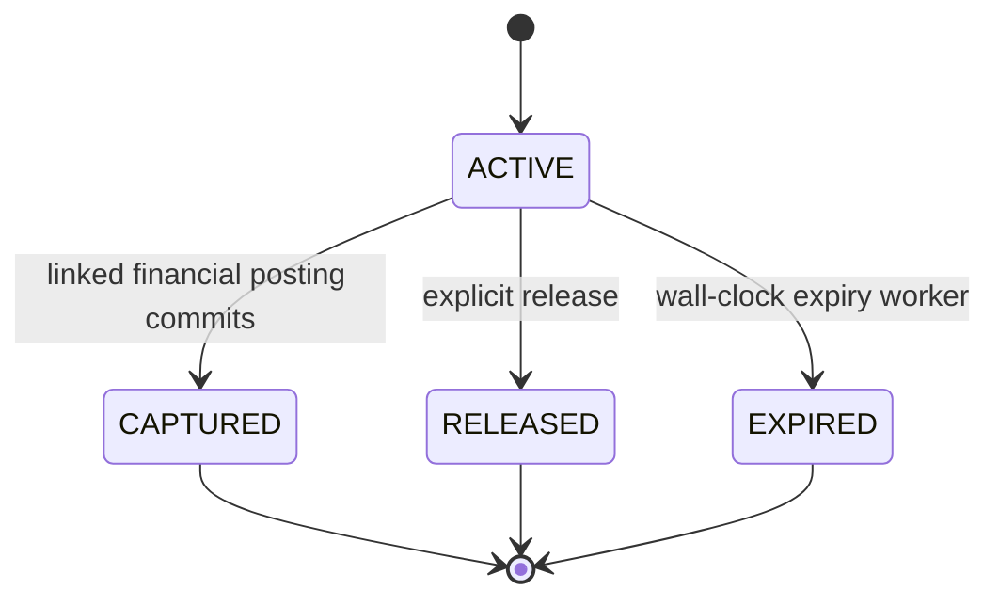

# Accounts, Balances, and Holds

> Classification: **SIMULATOR_DESIGN_CHOICE**. All identifiers and data are synthetic and non-routable.

## Account Identity and Data

Account identifiers visibly indicate simulation use, for example:

```text
SIM-ORDA-ACC-000001
SIM-NOMAD-ACC-000001
SIM-TENGRI-ACC-000001
```

No generated identifier should pass as a real IBAN or bank credential. If an IBAN-like display is added, it must carry an explicit simulation prefix and be rejected outside simulator APIs.

An account contains:

```text
account_id
bank_id
customer_id
product_id
type
currency
status
opened_at
closed_at
ledger_account_id
balance_version
```

`book_balance` and reservation totals live in an atomically maintained balance projection. The immutable ledger remains authoritative.

## Supported Products

The first version supports:

- current/payment account;
- optional savings account with the same transfer semantics;
- KZT money movement;
- optional USD/EUR accounts for explicitly same-currency operations.

Cross-currency posting is rejected until an FX bounded context can create balanced currency positions and exchange-rate/gain-loss entries.

## Lifecycle



Rules:

- only `ACTIVE` accounts may initiate normal debits;
- a frozen account rejects new outgoing activity but may accept configured inbound returns/credits;
- closing requires zero book balance, no active holds, and no unsettled outgoing payment;
- `CLOSED` and `REJECTED` are terminal;
- state transitions use expected status/version and create an audit event.

## Book and Available Balance

For a customer-deposit liability account:

```text
book_balance = posted credits - posted debits
available_balance = book_balance - active_hold_total
```

Example:

```text
book balance       500,000 KZT
active holds       100,000 KZT
available balance  400,000 KZT
```

A capture of the full hold debits the book by 100,000 and removes the 100,000 hold in the same transaction. Available balance remains 400,000; the money changes from reserved to booked expenditure without a temporary increase.

The API may return both balances, projection version, and `asOf` timestamp. A stale operations-dashboard projection may never be used to approve a debit.

## Hold Model

A hold contains:

```text
hold_id
account_id
amount
currency
purpose
source_reference
status
created_at
expires_at
captured_at
released_at
version
```



Holds are reservations and do not create general-ledger entries. Capture, release, and expiry are mutually exclusive idempotent transitions. A capture journal and `ACTIVE → CAPTURED` transition commit atomically.

Hold expiry uses wall-clock UTC, even while virtual simulation time is paused. Business scenarios may additionally schedule a virtual-time action, but correctness cannot depend on a paused clock.

## Concurrency Strategy

Debit decisions use pessimistic row locking in the owner database:

1. Resolve the authenticated account and command.
2. Lock all affected balance rows with `SELECT ... FOR UPDATE` in sorted account-ID order.
3. Recalculate available funds while holding the lock.
4. Validate product/status/currency/limits.
5. Post and update projections before commit.

For a 100,000 KZT account receiving concurrent 80,000 KZT debit requests, one transaction may commit and the other must re-evaluate to insufficient funds. A negative balance is forbidden unless a future explicit overdraft product changes the invariant.

Optimistic version fields remain useful for API responses and stale-update detection, but they are not the sole debit guard.

## Statements

Statement entries are a customer-readable projection of posted journal lines affecting the customer's ledger account. They include transaction reference, posting/value dates, debit/credit amount, running balance where available, channel, rail, and description safe for display.

Statement rows are produced in the same core transaction for immediate correctness and can be rebuilt from the immutable ledger. A statement table is not an independent money authority.

## Reconciliation Invariants

- Each account balance equals its ledger-account normal-side balance.
- Available balance equals book balance minus active holds.
- Active hold totals never become negative.
- Closed accounts have zero balance and zero active holds.
- Every statement financial row references a posted journal.
- Replaying the same command does not add a hold, statement entry, or journal.
