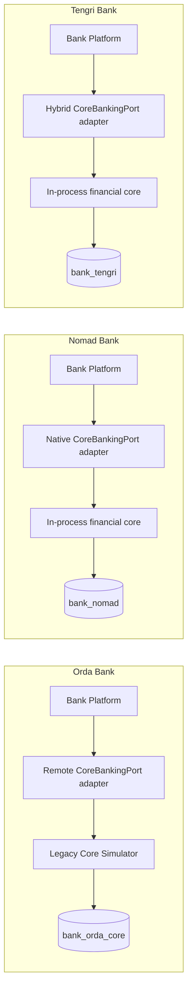

# Core Banking Model

> Classification: **SIMULATOR_DESIGN_CHOICE**. The core model is a fictional, simplified implementation based on standard banking architecture and accounting principles. It is not a representation of a named vendor product or a real bank's private core.

## Responsibilities

The financial core is the authoritative boundary for:

- account products and account lifecycle;
- customer-to-account financial relationships;
- currencies and money-scale validation;
- immutable double-entry journals;
- booked-balance and statement projections;
- holds and available funds;
- financial command references and deduplication;
- fees, settlement assets, rail payables, and suspense accounts;
- reversals and compensating entries.

It does not own browser authentication, transfer routing, card lifecycle, NPP participant positions, aliases, simulation scenarios, dashboards, or notifications.

## Deployment Variants



All variants use the same domain invariant code. Orda provides a physical legacy-style boundary and its own database; the other two provide local adapters to the same domain concepts.

The Orda edge database stores transfer workflow and digital context only. It must not mirror authoritative account balances or journals. If a remote response is lost, Orda queries or retries the same core command ID rather than reconstructing the result.

## Domain Modules

| Module | Purpose |
|---|---|
| Customer relationship | Maps a synthetic bank customer reference to accounts; holds no credentials |
| Account product | Defines currency, type, allowed debit behavior, and limits |
| Account | Lifecycle and ownership metadata |
| Balance and hold | Booked projection, reservations, and available-funds decisions |
| Ledger | Chart of accounts, journals, entries, reversal references |
| Posting | Domain-specific posting templates and invariant enforcement |
| Statement | Rebuildable customer-facing view of posted ledger effects |
| Financial command | Idempotent command identity, request hash, outcome, and journal references |
| Audit/outbox | Append-only operational audit and reliable event handoff |

No generic `Utils`, generic arbitrary posting endpoint, or shared mutable `Account` entity crosses these modules.

## CoreBankingPort

The port exposes intent-specific commands:

```text
getAccount
reserveFunds
releaseHold
postInternalTransfer
fundInterbankPayment
settleOutboundPayment
refundUnsettledPayment
recognizeInboundSettlement
creditInboundBeneficiary
captureCardAuthorization
reverseCardCapture
```

Every mutation includes:

- stable `commandId`;
- bank and actor/service context;
- correlation and causation IDs;
- expected money/currency;
- business reference such as transfer, payment, authorization, or cycle ID;
- operation-specific validation data.

The remote interface exposes command-status lookup. An HTTP timeout means the outcome is unknown. Callers retry/query the identical command; they do not issue a new financial command or infer that it failed.

## Core Transaction Boundary

For a posting command, the core performs one database transaction:

1. Insert or lock the financial-command/idempotency record.
2. Lock affected balance and hold rows in deterministic ID order.
3. Revalidate account status, ownership authorization, currency, product rules, limits, and available funds.
4. Create a draft journal and positive debit/credit entries.
5. Validate that debits equal credits per currency.
6. Mark the journal posted and update balance/statement projections.
7. Apply the legal hold or command state transition.
8. Insert audit and outbox rows.
9. Commit once.

No network call occurs while holding account or settlement row locks. Remote work is orchestrated before or after the local transaction through idempotent commands and sagas.

## Persistence Model

The exact schema may evolve through Flyway, but the ownership model requires at least:

```text
account_product
account
account_balance
hold
ledger_account
journal_transaction
ledger_entry
statement_entry
financial_command
idempotency_record
inbox_message
outbox_event
audit_record
```

Important database constraints include:

- unique simulation account ID;
- unique financial source reference;
- one balance row per account/currency;
- positive ledger-entry and hold amounts;
- currency equality between account, hold, and posting;
- one terminal effect per command;
- immutable posted journals and entries;
- legal state values and versions.

## Consistency and Recovery

Strong consistency ends at the core database commit. A bank-platform saga, card authorization, NPP settlement, notification, or operations projection may observe the result later.

Recovery workers detect:

- an Orda edge command with a completed core command but stale workflow state;
- a funded interbank payment never submitted to NPP;
- an NPP-settled payment not yet reflected in the bank settlement asset;
- an inbound settlement still in suspense;
- expired or orphaned holds;
- published or unprocessed outbox/inbox records;
- balance/statement projections inconsistent with the immutable ledger.

Recovery never edits a posted journal. It resumes an idempotent step, rebuilds a projection, or posts a new compensating/return journal.

## Initial Simplifications

- KZT is the only currency enabled for end-to-end payment movement in the first complete vertical slice.
- USD/EUR accounts may be added for same-currency flows, but no implicit currency conversion is allowed.
- Loans, interest accrual, overdrafts, regulatory reporting, branch cash management, and real external clearing networks are excluded.
- A customer has no overdraft unless a later explicit product implements one; all current debit flows reject insufficient available funds.
- The ledger is immutable accounting storage, not a full event-sourcing framework.
